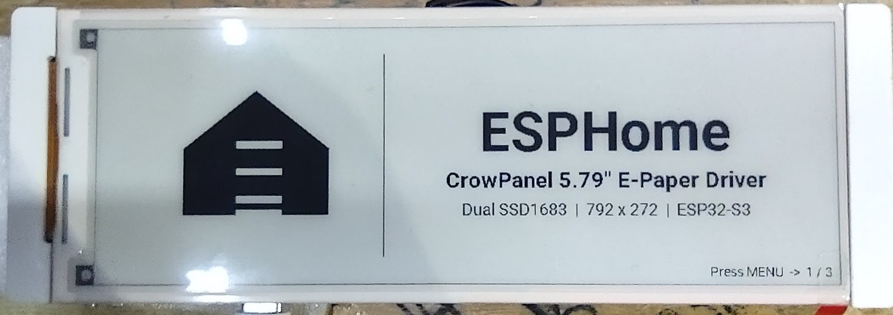
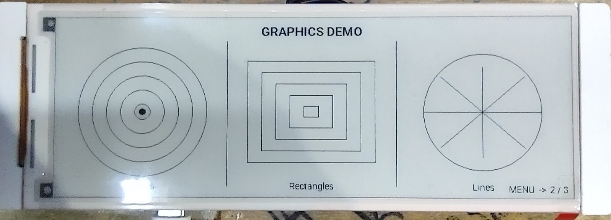
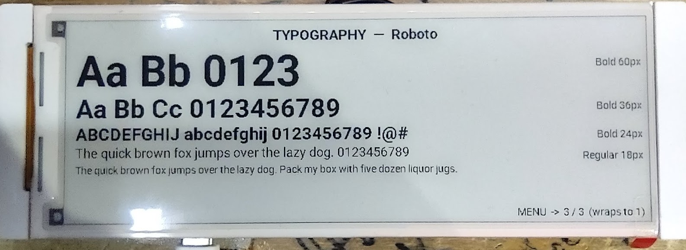
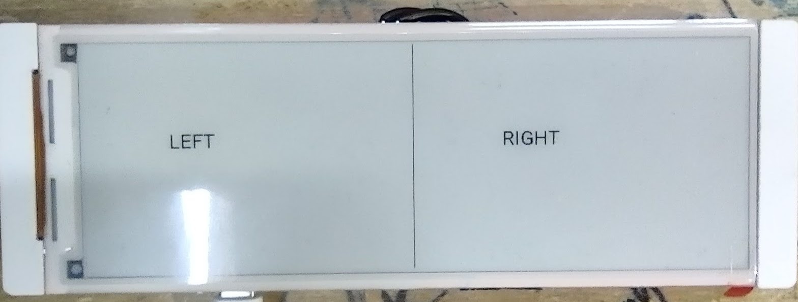
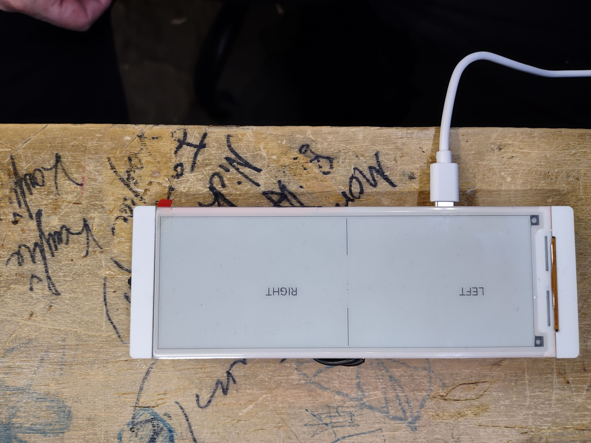
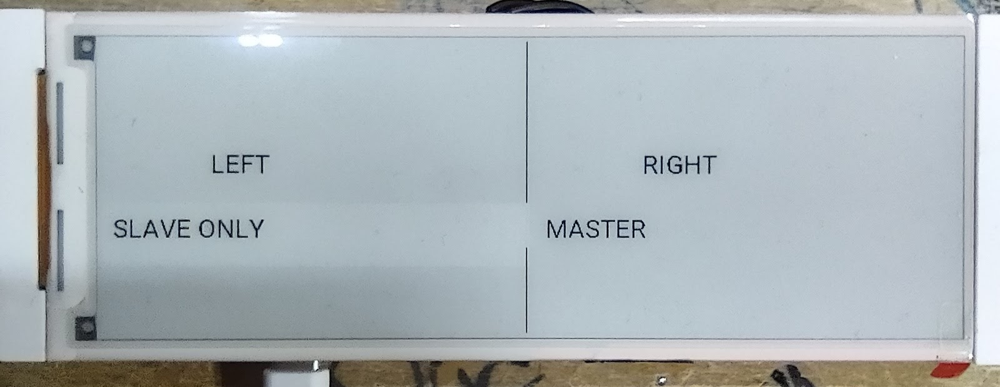
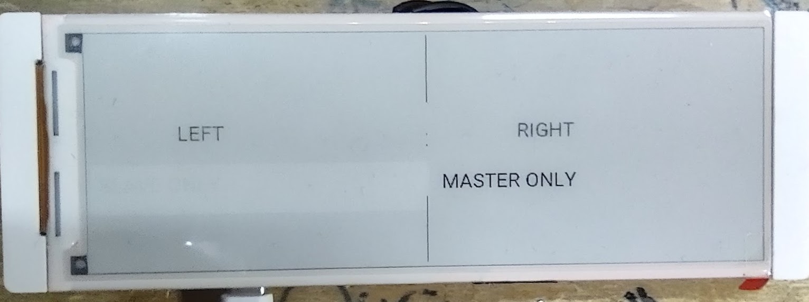

# ESPHome: Elecrow CrowPanel 5.79" E-Paper Display Driver

A custom ESPHome external component for the **Elecrow CrowPanel 5.79" e-paper display** (model DIS08792E). Supports the ESPHome lambda drawing API, LVGL, and **partial refresh**.

## Demo

Three-page interactive demo cycled with the MENU button (GPIO2). Full source in [`demo.yaml`](demo.yaml).

**Page 1 — Boot screen** (ESPHome logo drawn in primitives):



**Page 2 — Graphics demo** (circles, rectangles, lines):



**Page 3 — Typography showcase** (Roboto font sizes):



## Hardware

| Spec | Value |
|------|-------|
| Display | Elecrow CrowPanel 5.79" E-Paper (DIS08792E) |
| Resolution | 792 × 272 pixels, black & white |
| Driver ICs | Dual SSD1683 (one per half of the panel) |
| MCU | ESP32-S3 (tested on ESP32-S3-WROOM-1-N8R8, 8MB Flash, 8MB PSRAM) |
| Framework | ESP-IDF (not Arduino) |

### Pin Connections (CrowPanel default wiring)

| Signal | GPIO |
|--------|------|
| SPI CLK | GPIO12 |
| SPI MOSI | GPIO11 |
| CS | GPIO45 |
| DC | GPIO46 |
| RST | GPIO47 |
| BUSY | GPIO48 |
| PWR (optional) | GPIO7 |

### Optional Buttons / Rotary Encoder

The CrowPanel board also exposes:

| Input | GPIO |
|-------|------|
| MENU button | GPIO2 |
| EXIT button | GPIO1 |
| Rotary encoder UP | GPIO6 |
| Rotary encoder DOWN | GPIO4 |
| Rotary encoder CLICK | GPIO5 |

---

## Installation

### Option A — GitHub source (recommended)

```yaml
external_components:
  - source: github://samperk1/esphome-crowpanel-579
    components: [crowpanel_579]
```

### Option B — Local copy

Copy the `components/crowpanel_579` folder into your ESPHome `config/components/` directory:

```yaml
external_components:
  - source:
      type: local
      path: components
    components: [crowpanel_579]
```

---

## Basic YAML (lambda mode)

```yaml
spi:
  clk_pin: GPIO12
  mosi_pin: GPIO11

display:
  - platform: crowpanel_579
    id: my_display
    cs_pin: GPIO45
    dc_pin: GPIO46
    reset_pin: GPIO47
    busy_pin:
      number: GPIO48
      mode:
        input: true
        pulldown: true
    rotation: 90°
    update_interval: never
    lambda: |-
      it.fill(Color::BLACK);  // clears screen to white (see color note below)
      it.print(10, 10, id(my_font), Color::WHITE, "Hello World");
      id(my_display).display();
```

> **Color convention:** This display uses an inverted convention in lambda mode.
> `Color::WHITE` draws **black ink**. `Color::BLACK` clears to **white paper**.
> Use `it.fill(Color::BLACK)` for a white background, then draw with `Color::WHITE`.

---

## LVGL

```yaml
spi:
  clk_pin: GPIO12
  mosi_pin: GPIO11

display:
  - platform: crowpanel_579
    id: my_display
    cs_pin: GPIO45
    dc_pin: GPIO46
    reset_pin: GPIO47
    busy_pin:
      number: GPIO48
      mode:
        input: true
        pulldown: true
    rotation: 90
    auto_clear_enabled: false

lvgl:
  displays:
    - my_display
  color_depth: 16
  bg_color: 0xFFFFFF
  on_draw_end:
    - lambda: "id(my_display).display();"
  pages:
    - id: main_page
      widgets:
        - label:
            text: "Hello from LVGL"
            align: CENTER
            text_color: 0x000000
```

> **LVGL notes:**
> - `color_depth: 16` is required — 1-bit mode is not supported.
> - `auto_clear_enabled: false` is required.
> - `rotation: 90` is required for correct LVGL orientation.
> - Call `display()` from `on_draw_end`, not from `update()`.
> - Use `bg_color: 0xFFFFFF` (white paper) and `text_color: 0x000000` (black ink).

---

## Partial Refresh

The driver supports windowed partial refresh via `partial_refresh(x, y, w, h)`. Only the specified region is updated, which is significantly faster than a full refresh for small changes.

```yaml
display:
  - platform: crowpanel_579
    id: my_display
    ...
    auto_clear_enabled: false
    update_interval: never
    lambda: |-
      // Draw your updated content into the buffer
      it.filled_rectangle(10, 10, 200, 60, COLOR_OFF);  // white background
      it.print(20, 20, id(my_font), COLOR_ON, "Updated!");
      // Then partial refresh just that region
      id(my_display).partial_refresh(10, 10, 200, 60);
```

**Important notes:**
- Coordinates are **physical** (no rotation applied) — 792 wide × 272 tall.
- `partial_refresh` uses physical coordinates even if your display has `rotation: 90` set.
- A full `display()` call before the first partial refresh establishes the baseline for the ghosting waveform. Ghosting builds up over many partial refreshes; do a full `display()` periodically (e.g. once per hour) to reset it.
- The refresh takes ~1–3 seconds and blocks the main loop.

### Partial refresh test photos

These photos show the 4-step partial refresh test (`partial_refresh_test.yaml`):

**Step 0 — Full refresh baseline** (seam line + LEFT/RIGHT labels):



**Step 1 — Seam crossing** (partial refresh spanning both chips):



**Step 2 — Slave chip only** (physical right half):



**Step 3 — Master chip only** (physical left half):



---

## Optional: Power Pin

Add `power_pin: GPIO7` to force a hard power cycle of the display chip on boot. This clears any stuck BUSY state that a normal RST pulse can't recover from — useful after repeated OTA flashes or safe-mode cycles. Also required if your board controls display power for battery management.

```yaml
display:
  - platform: crowpanel_579
    ...
    power_pin: GPIO7
```

---

## How It Works

The 5.79" panel uses **two SSD1683 driver chips** wired to the same SPI bus — one chip drives the left half, the other drives the right half. Both chips share CS, DC, RST, and BUSY lines. They are differentiated by their command sets:

- **Slave** (physical right half, columns 0–399): commands `0x91`, `0xA4`, `0xA6`, `0xC4/C5/CE/CF`
- **Master** (physical left half, columns 392–791): commands `0x11`, `0x24`, `0x26`, `0x44/45/4E/4F`

The 8-pixel overlap at columns 392–399 (byte 49 in the buffer) is shared between both chips and provides seam alignment.

The single framebuffer is 99 bytes × 272 rows = 26,928 bytes. On each `display()` call, bytes 0–49 per row go to the slave and bytes 49–98 per row (reversed) go to the master. A full refresh takes approximately 3 seconds.

### Buffer / color convention

| Buffer bit | Display |
|-----------|---------|
| `1` | White paper |
| `0` | Black ink |

In **lambda mode** the convention is inverted at the API level:
- `Color::WHITE` → black ink (bit cleared to 0)
- `Color::BLACK` → white paper (bit set to 1)

In **LVGL mode** (`draw_pixels_at`) the luminance threshold applies:
- RGB luminance ≥ 382 → white paper
- RGB luminance < 382 → black ink

---


## Known Limitations

- Coordinates in `partial_refresh()` are always physical (landscape) regardless of `rotation` setting.
- The `display()` and `partial_refresh()` calls block the main loop (~1–3 seconds) while the e-paper panel refreshes.
- Ghosting accumulates with repeated partial refreshes — periodically call `display()` for a full refresh to clear it.
- Tested and confirmed working on ESPHome **2026.3.x** with ESP-IDF framework only (not Arduino).
- **Broken on ESPHome 2026.4.x** — lambda mode produces all-black screen due to changes in `DISPLAY_TYPE_BINARY` handling. Stay on 2026.3.x until this is resolved.

---

## Reference Documentation

- [SSD1683 Datasheet](docs/SSD1683_Datasheet.pdf) — driver IC used in this panel
- [CrowPanel 5.79" Hardware Reference](docs/CrowPanel_579_Hardware.pdf) — pin mapping, schematic
